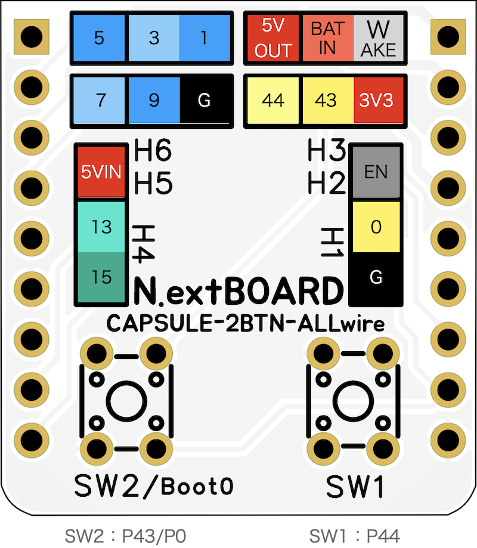

# 2btn_ALLwire
An extension board for M5Capsule, to add two switches and attach wires to all GPIO and power supply pins.

**Pre-manufactured board**
- Colorful silkscreen version is available on [BOOTH](https://nananauno.booth.pm/items/5257468).
- Normal version will be soon available.

## Pinout

## Features
- Easily add two tact switched to M5Capsule.
- Through holes for attaching lead wires to all GPIO and power supply pins of M5Capsule.
- Boot switch to enter StampS3 into boot loader mode.

## Board specification
- Demension: HxW 24mm x 26mm
- Thickness: 1.6mm
- Two tact switches (4.5mm x 4.5mm, 3.0mm pitch pins)
 GPIO pins connected to the switches: SW1=P44, SW2=P43/P0
- Two pin headers (9 pins, 2.54mm pitch pins)

SW2 is shared by P43 and P0. Hold SW2 and push reset on M5Capsule to enter StampS3 into boot loader mode for writing firmware.
